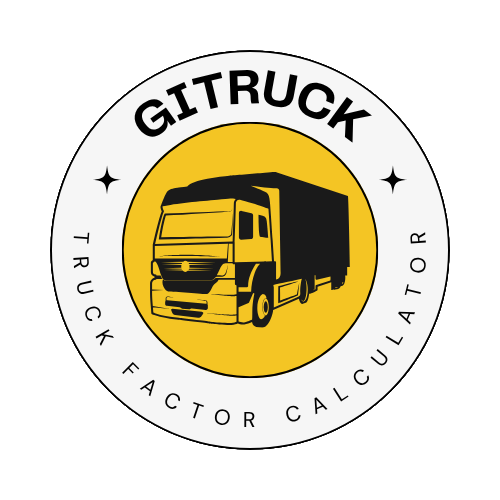
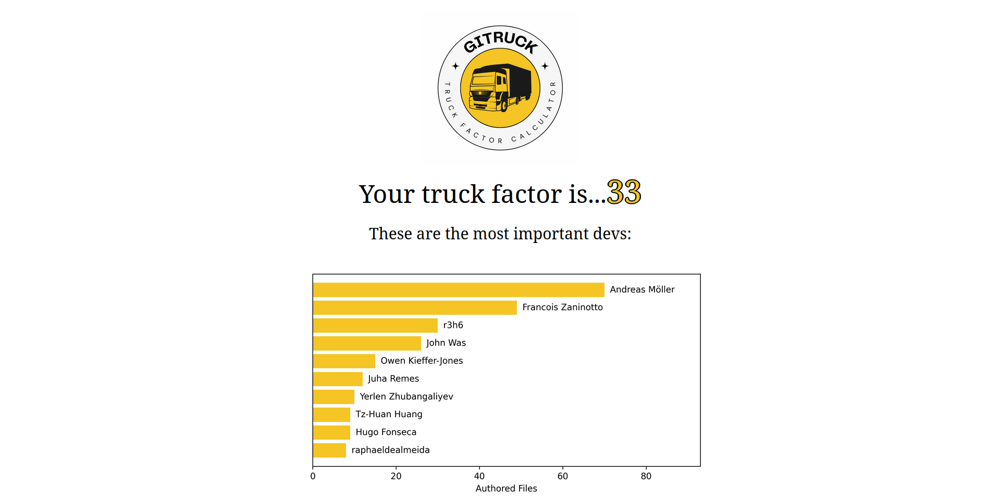

<!-- LOGO -->
<br />
<p align="center">
  <a href="https://github.com/bereis01/gitruck">
    
  </a>
  <h3 align="center"><strong>Gitruck</strong></h3>
  <p align="center">
    Uma ferramenta para análise de colaboração em repositórios!
    <br />
    <a href="https://github.com/bereis01/gitruck/issues">Report Bug</a>
    ·
    <a href="#Contato">Send Feedback</a>
  </p>
</p>
<div align="center">
    
</div>

<!-- DESCRIPTION -->
# 🚚 Sobre o Projeto

**Gitruck** é uma ferramenta para análise da colaboração entre os desenvolvedores responsáveis por um repositório do GitHub. A funcionalidade principal da ferramenta é o cálculo do ***truck factor*** do repositório, isto é, *"a quantidade de desenvolvedores que, caso atropelados por um caminhão, levarão à descontinuação do projeto"*. Em outras palavras, a quantidade de desenvolvedores responsável pela maior parte da manutenção do sistema. Além disso, também são apresentadas outras métricas colaborativas relevantes, como os autores com a maior quantidade de arquivos sobre os quais são responsáveis e a evolução da quantidade de pessoas realizando *commits* e, de forma geral, contribuindo ao longo do tempo.



<!-- TECHNOLOGIES -->
# 📟 Tecnologias

A ferramenta foi inteiramente implementada na linguagem de programação Python, em sua versão 3.12.3. Ela é composta de três módulos. O primeiro deles é responsável pela interface via linha de comando e, essencialmente, recebe, realiza o *parsing* e retorna internamente à aplicação os parâmetros fornecidos pelo usuário. Sua implementação foi baseada na biblioteca *argparse*, a qual faz parte da biblioteca padrão do Python. O segundo módulo é responsável pelo cálculo das diversas métricas apresentadas, sendo a principal delas o ***truck factor***. Nele, a biblioteca *GitPython* é utilizada para a clonagem local do repositório e para a extração das informações dele, como *commits* em um arquivo. Além disso, um programa, denominado *linguist*, é utilizado para a extração especificamente dos arquivos de código em um repositório, por ele fazer uma filtragem automática de arquivos terceiros ou automaticamente gerados. O módulo acessa esse programa por meio de uma interface da biblioteca *GitPython*, a qual permite a execução de comandos do terminal no contexto do repositório. Por fim, o último módulo é responsável pela geração da visualização dos resultados em formato *.html*. Este módulo não utiliza nenhuma biblioteca em especial. Os gráficos são gerados por meio da *Matplotlib*, enquanto o documento em si é montado manualmente.

<!-- USAGE -->
# ⚙️ Utilização

## Instalação via pip (Recomendado)

1. Faça o download do arquivo ***gitruck-X.Y.X.tar.gz*** da *release* mais recente deste repositório.

2. Em uma janela de terminal posicionada no local em que o download foi feito, execute:

```sh
$ pip install gitruck-X.Y.Z.tar.gz
```

3. A ferramenta pode ser executada por meio do comando:

```sh
$ gitruck <repo_url>
```

## Instalação Manual

1. Clone este repositório por meio do comando e se posicione na raiz do projeto:

```sh
$ git clone https://github.com/bereis01/gitruck
$ cd gitruck
```

2. Crie um ambiente virtual Python e instale os pré-requisitos:

```sh
$ python3 -m venv ./.venv
$ source ./.venv/bin/activate
$ pip install -r requirements.txt
```

3. A ferramenta pode ser executada por meio do comando:

```sh
$ python3 -m gitruck <repo_url>
```

## Exemplo de Utilização

Para a geração de um relatório referente a este repositório, execute:

```sh
$ gitruck https://github.com/bereis01/gitruck
```

O relatório será gerado em formato *.html* em um diretório *report/*, criado no mesmo local em que o comando foi executado. Para o visualizar, abra o arquivo *report/index.html* em um navegador.

Para gerar um relatório que considera apenas um período de tempo específico, execute:

```sh
$ gitruck --since 2015 --until 2025 https://github.com/bereis01/gitruck
```

O cálculo do *truck factor* e de demais métricas será feito com informações apenas deste período de tempo.

Por fim, para habilitar o modo verboso, o qual imprime informações variadas sobre a execução do programa no terminal, execute:

```sh
$ gitruck --verbose https://github.com/bereis01/gitruck
Cloning repository locally...DONE
Getting code file paths...DONE
Getting contributor names...DONE
Getting commits on each file...DONE
Calculating truck factor...DONE
Calculating contributors per year...DONE
Calculating contributions per year...DONE
Calculating code insertions and deletions...DONE
Printing logo...DONE
Printing truck factor...DONE
Printing top contributors...DONE
Printing contributor statistics...DONE
Printing contribution statistics...DONE
Writing results to './report/'...DONE
```

Mais informações sobre as *flags* aceitas pela ferramenta podem ser obtidas por meio do comando:

```sh
$ gitruck --help
```

## Execução dos Testes

1. Clone este repositório por meio do seguinte comando e se posicione na raiz do projeto:

```sh
$ git clone https://github.com/bereis01/gitruck
$ cd gitruck
```

2. Crie um ambiente virtual Python e instale os pré-requisitos:

```sh
$ python3 -m venv ./.venv
$ source ./.venv/bin/activate
$ pip install -r requirements.txt
```

3. Os testes podem ser executados por meio do comando:

```sh
$ pytest tests/
```

<!-- CONTACT -->
# ☎️ Contato

Bernardo Reis de Almeida (bera01@ufmg.br)
